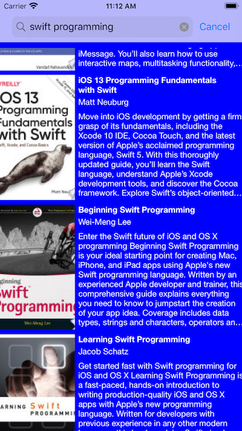
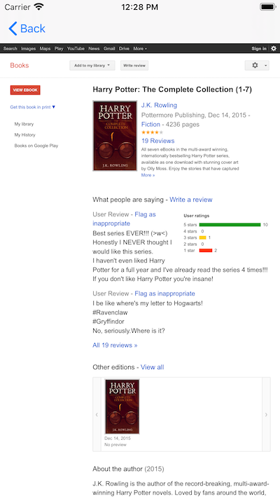

# Google Books

Google Books is a sample iOS app written in Swift that uses book information from googleapis to display books about various topics from user searches. It uses a tableview with an async imageview for the cells. And a WKWebView to display the Google page about the book. The search page and cells are laid out using constraints programatically.

## License

Google Books is licensed under the MIT License. See the LICENSE file for more information, but basically this is sample code and you can do whatever you want with it.